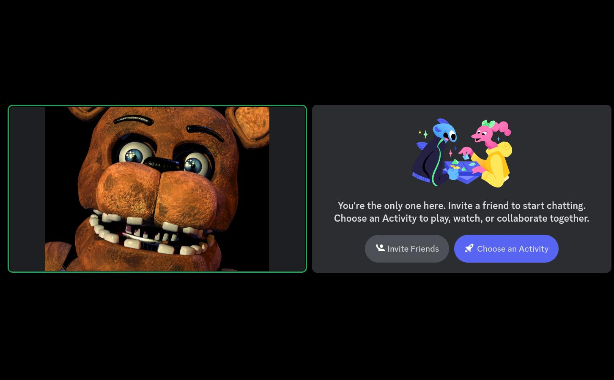
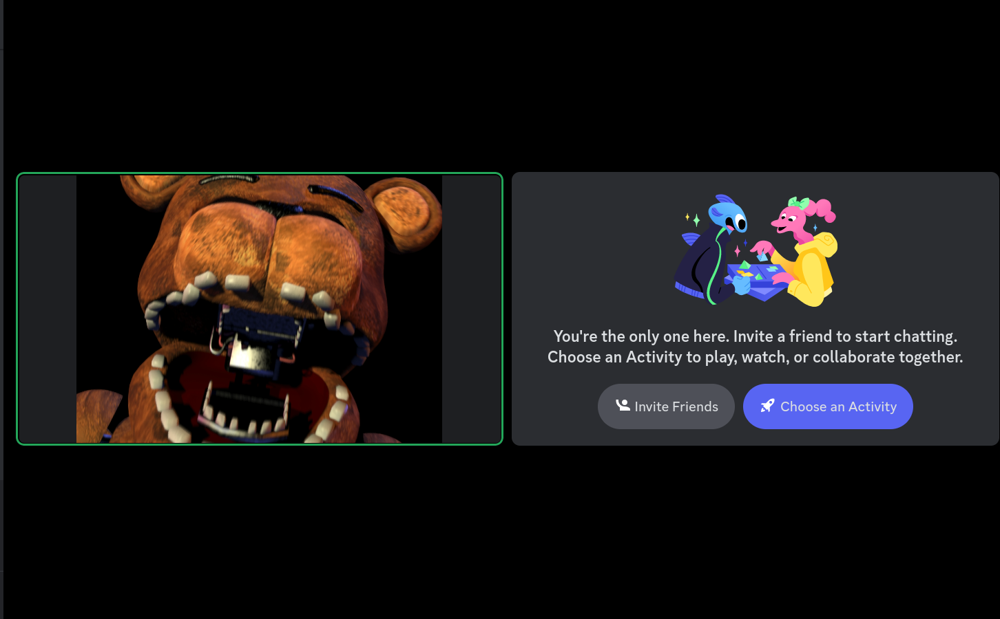

# Freddy Camera

**Disclaimer**: I do not own Five Nights At Freddy's (the game from which the character and the jumpscare were taken from). This program is just a little silly joke.

**Advice**: if you had any issues during the installation, usage, or configuration of the program, please, contact the developer at https://t.me/megahomyak

This program will allow you to create a fake webcam and put the magnificient FREDDY FAZBEAR as its output. You will be able to use the added camera in Discord, Skype and other applications that accept camera output and allow you to choose the camera. Freddy's jaw will move with you speaking! All of the Freddy frames are taken from his jumpscare.

## Screenshots

## Demonstration video

https://youtube.com/watch?v=LgtxSnCMJFs

## Installation

* Ensure that you have a stable internet connection for the duration of this tutorial
* Open the command prompt for your respective operating system (if you don't know how, google it)
* **Windows**: check if you have Python 3.8, 3.9 or 3.10 installed by opening the terminal and executing `python --version`
* **Windows**, if you don't have Python at all: install Python 3.8, 3.9 or 3.10 from https://www.python.org/, **be sure to check "Add Python to PATH" in the installer**, it will be available on one of the installation steps. Uninstall Python and install it again if you forgot to check that box
* **Windows**, if you don't have the right version of Python: uninstall the current version and install a new one according to the step above
* **Linux**: it's likely that you already have Python 3.8, 3.9 or 3.10 installed. Check if you have it by executing `python3 --version` in your terminal. If you don't have the right version of Python, google how to install Python on your Linux distribution (and install Python 3.8, 3.9 or 3.10)
* **macOS**: it's likely that you already have Python 3.8, 3.9 or 3.10 installed. Check if you have it by executing `python3 --version` in your terminal. If you don't have the right version of Python, google how to install Python on macOS (and install Python 3.8, 3.9 or 3.10)
* **Linux, macOS**: execute `python3 -m pip install freddy_camera`. If this resulted in an error containing "No module named pip", execute `python3 -m ensurepip --default-pip`
* **Windows**: execute `python -m pip install freddy_camera`. If this resulted in an error containing "No module named pip", execute `python -m ensurepip --default-pip`
* **Windows, macOS**: install OBS (https://obsproject.com/)
* **Windows, macOS**: start OBS
* **Windows, macOS**: click "Start Virtual Camera"
* **Windows, macOS**: click "Stop Virtual Camera"
* **Windows, macOS**: close OBS
* **Linux**: install v4l2loopback (`sudo apt install v4l2loopback-dkms`, or, if you don't have `apt`, use the package manager of your distribution)

## Usage

**Warning**: restart the program when you change or enable your microphone (so that the program will use the newly connected microphone, otherwise there may be no audio input to the program)

**Warning**: Freddy Camera uses your *main system microphone* and does *not* apply any filters, such as noise cancellation, to it!

**Advice**: you don't have to have OBS open for the program to work!

* Ensure that the virtual camera is not used anywhere
* **Windows, macOS**: execute `python -m freddy_camera`
* **Linux**, once per session: create a new virtual camera (`sudo modprobe v4l2loopback devices=1`)
* **Linux**, once per session: a new camera should appear on the list (`ls /dev/ | grep video`, compare to the previous output), remember the name of this new camera
* **Linux**: execute `python -m freddy_camera -d /dev/PUT_THE_NAME_OF_THE_CAMERA_HERE` (for example, `python -m freddy_camera -d /dev/video2`)
* In the settings of the application you're going to use, select the new camera
* To stop the program, press Control+c on your keyboard
* If your microphone seems too sensitive or too insensitive, check the section below

## Settings

Execute `python -m freddy_camera --help` to get the list of available settings.
